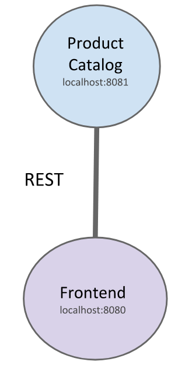

# Pact Contract Testing Workshop

A sample micro-services application that demonstrates how Pact Contract tests work for REST as well as messaging interactions. Services implemented in Kotlin + Spring Boot.



## Running the demo application

In terminal 1 start the catalog consumer/provider service
```
$ catalog/gradlew -p catalog bootRun
```

In terminal 2 start the frontend consumer service
```
$ frontend/gradlew -p frontend bootRun
```

Open in the browser http://localhost:8080/

## Import Projects
Make sure you import the different spring boot gradle projects in your IDE not the whole git repository folder.

### IntelliJ IDEA
To import a project in [IntelliJ](https://www.jetbrains.com/idea/download/) follow these steps:
- Go to `File -> Open` and select the project folder `catalog`
- On the Import Project from Gradle dialog select `Use auto-import` and `Use default gradle wrapper` options. Then click OK.

## References
- https://docs.pact.io/implementation_guides/jvm/consumer/junit5
- https://docs.pact.io/implementation_guides/jvm/provider/junit5spring
- https://kreuzwerker.de/post/migrating-pact-contract-tests-from-junit4-to-junit5
- https://github.com/tinexw/cdc-with-pact/tree/junit5
- https://rieckpil.de/testing-your-spring-resttemplate-with-restclienttest

